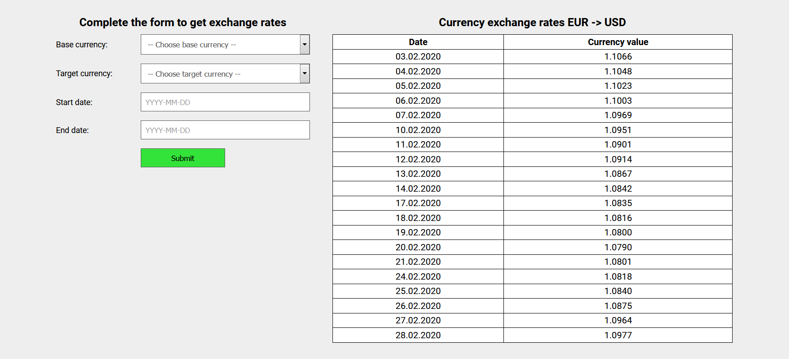

# Currency report

Web application that enables retrieving currency exchange rates for specified time period.

## Table of contents

* [General info](#general-info)
* [How to start](#how-to-start)
* [Technologies](#technologies)
* [Screenshots](#screenshots)

## General info

Currency report allows you to find currency exchange rates for interesting period of time.
There are 15 most popular currencies available.

## How to start

```bash
git clone https://github.com/ljurak/currency-reporter.git
cd currency-reporter
mvn clean package
cd target
java -jar currency-report.jar
```
The app will start on http://localhost:8080

## Technologies

Project is created with:
* Java 11
* Spring Boot
* Thymeleaf

## Screenshots


Main page
